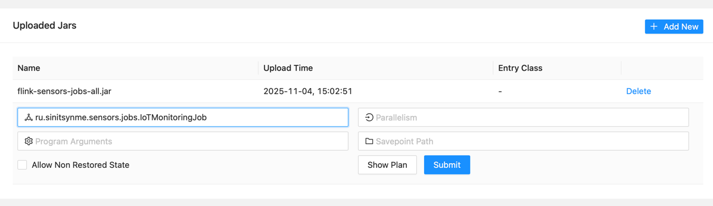
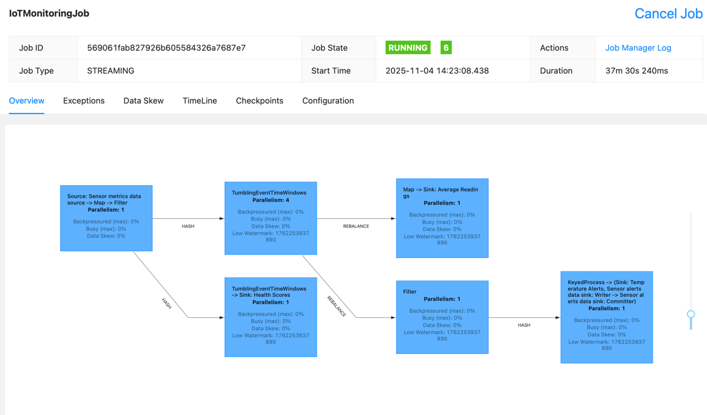
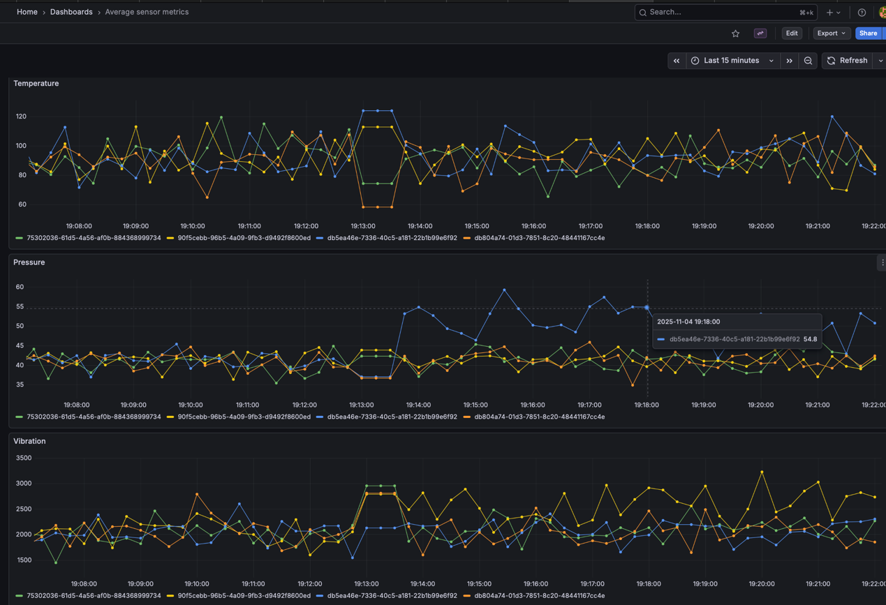
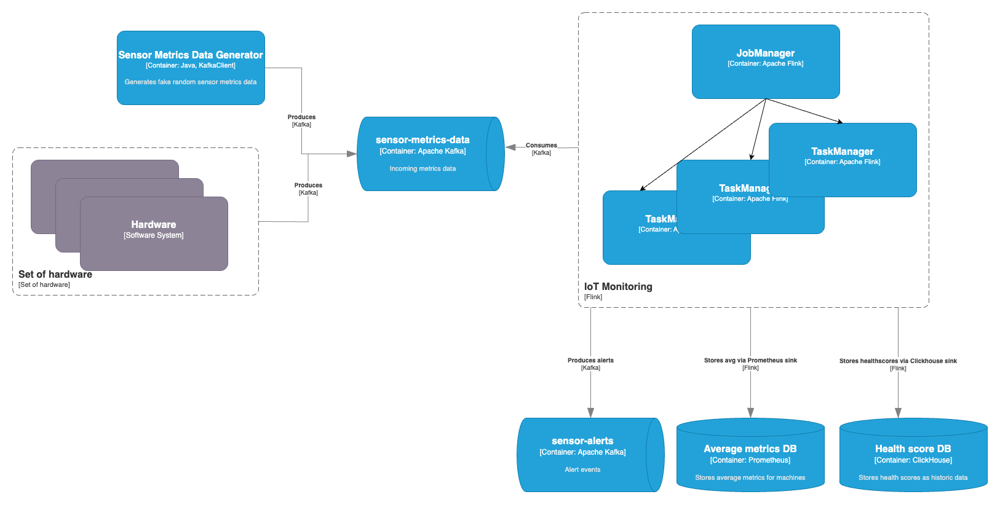

# Flink Sensors

Demonstration of Apache Flink streaming features

## Description of the project

Let's pretend we need to collect various metrics of hardware and manipulate them: 
- aggregate average metrics of machine sensor by period (we need stable data);
- send alerts if we find that one metric is beyond the set threshold;
- calculate health-score for machine to decide if it is efficient overall

We have only one source of data that we need to modify and output in various ways: 
- collect average metrics by machine and timestamp to visualize it on dashboards;
- send alerts to other systems as events to have a reaction;
- save health-score to storage to analyze it later.

Apache Flink can help us to manage all these flows of data

## Launching project

Requirements: Docker, Java 17.

1. Launch all containers: `docker compose up -d`. Launched containers: 
   1. Zookeeper
   2. Kafka
   3. Kafka topic creator (topics with partitions)
   4. Kafka UI to watch all topics activity
   5. Flink Job Manager
   6. Flink Task Manager (2 replicas)
2. Wait until all topics are created
3. Execute `./gradlew build` on [flink-sensors-jobs](flink-sensors-jobs)
4. If you want to launch job with UI:
   1. Go to http://localhost:18081 and walk to `Submit new job`
   2. Choose flink-sensors-jobs-all.jar (shadowed jar) and set `ru.sinitsynme.sensors.jobs.IoTMonitoringJob` as Entry class
   
   3. Submit
5. Else you can do it by REST API:
   1. Send JAR: `curl -X POST -H "Expect:" -F "jarfile=@./flink-sensors-jobs/build/libs/flink-sensors-jobs-all.jar" http://localhost:18081/jars/upload`
   2. Take JAR_ID from result. Example result (JAR_ID is bold): {"filename":"/tmp/flink-web-0d6f0f9d-2260-4c1b-968f-7d15d7dbf394/flink-web-upload/**d4181d27-52f4-4eea-a79e-9888e362a8aa_flink-sensors-jobs-all.jar**","status":"success"}
   3. Submit Job Request
   <code>curl -X POST http://localhost:18081/jars/<JAR_ID>/run \
         -H "Content-Type: application/json" \
         -d '{
               "entryClass": "ru.sinitsynme.sensors.jobs.IoTMonitoringJob"
             }'
   </code>
6. Go to `Jobs -> Running Jobs` in UI to watch the result

7. If you want to watch average metrics in Grafana:
   1. Go to http://localhost:13000
   2. Login with admin/admin
   3. Open `Average sensor metrics` dashboard
   
   4. As an experiment, a couple of sensors was marked broken in GeneratorApp.java. Obviously they are showing off on the dashboard, you can watch it

## Architecture of the project

Java project is separated in three modules: 
- [flink-sensors-data-generator](flink-sensors-data-generator)
  - module for fake generation of sensor metrics
  - can be configured by application.properties
- [flink-sensors-jobs](flink-sensors-jobs)
  - module for storing flink jobs in one jar
  - may contain more than one job
  - can be configured by application.properties
- [sensors-commons](sensors-commons)
  - module for common DTOs

### Input

Modeled by fake generated sensor metrics, depending on random.

Sends generated data to sensor-metrics-data Kafka topic

### Processing
Happens in [IoTMonitoringJob.java](flink-sensors-jobs/src/main/java/ru/sinitsynme/sensors/jobs/IoTMonitoringJob.java)

sensor-metrics-data Kafka topic is consumed by Apache Flink:
- source is watermarked to prevent delayed data
- source metrics are aggregated with TumblingEventTimeWindow into average metrics stream by [AverageMetricAggregate.java](flink-sensors-jobs/src/main/java/ru/sinitsynme/sensors/AverageMetricAggregate.java). Parallelism is set to 4 to make CPU-bounded operations quicker
  - stream entries are mapped into string to log them
  - stream entries are mapped into PrometheusTimeSeries to be saved to Prometheus by Prometheus Remote Write sink
  - stream entries are processed by stateful [AlertFunction.java](flink-sensors-jobs/src/main/java/ru/sinitsynme/sensors/alert/AlertFunction.java). If alert opens or closes, we send message to sensor-alerts Kafka topic
  - stream entries are processed by non-stateful [HealthScoreProcessFunction.java](flink-sensors-jobs/src/main/java/ru/sinitsynme/sensors/HealthScoreProcessFunction.java) and calculates health-score of machine by simple business-rules

### TBC 
- Going to add Clickhouse sink to store historical health scores